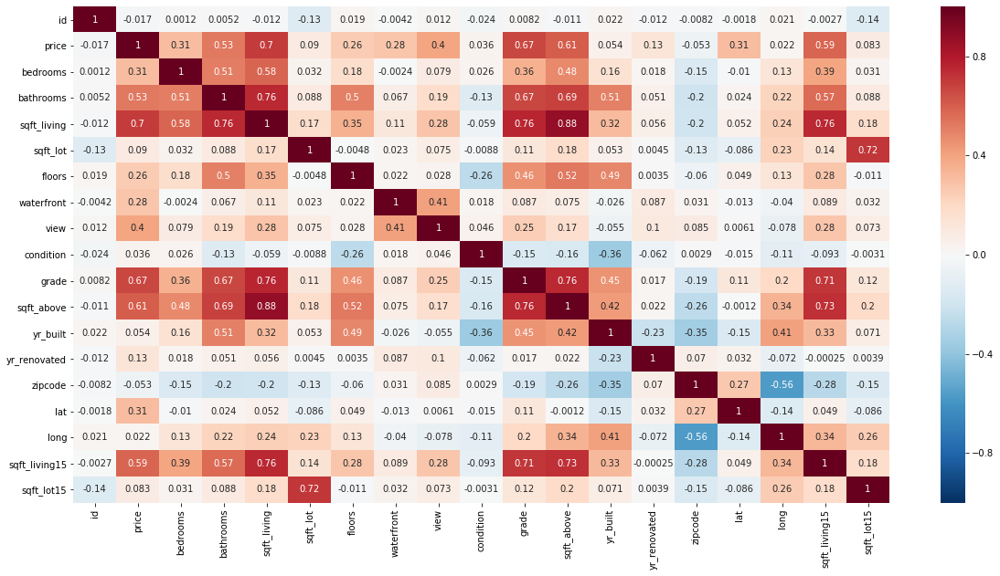
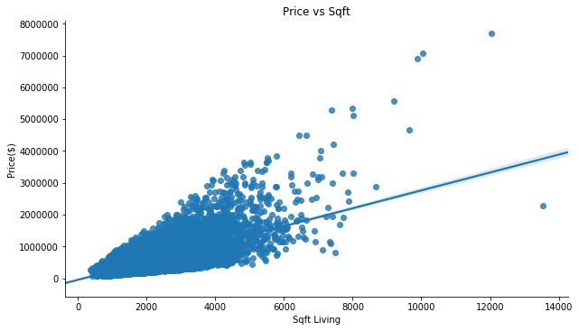

## Mod 2 Project
# King County House Sale Prices

## Introduction
King County is a county located in the U.S. state of Washington. As of the 2019 estimate its population is approx 2,252,782. It is the most populous county in Washington, and the 13th most populous in the United States. The county seat is Seattle which is the state's largest city.

## Key Questions:

Q1- What is the average cost of a house in King County?

Q2- Does Renovation have an effect on increasing the price of a house?

Q3- What are the important features to consider while selling a house?

Q4- How does the distance to a workplace effect the cost of a house?

Q5- Does having a waterfront view effect the price of a house?

## Data description:
King County Dataset: 21597 rows x 21 columns

Categorical variables:  
Condition: How good is the condition of the house on a scale of 1 to 5  
Grade: values 1-13, rating of the house’s construction/design  
Waterfront: House which has a waterfront   
View: index 0-4, rating of the views from the house  
Zipcode:zipcode of the house  

Continuous variables:  
Price: Price of the house(USD)  
Sqft_living: square footage of the house  
sqft_lot: square footage of lot  
Sqft_above: square footage of house excluding basement  
Sqft_living15: square footage of living space for the nearest 15 neighbors  
Sqft_lot15: square footage of lot for the nearest 15 neighbors  
Bedrooms: numbers of bedrooms  
Bathrooms: number of bathrooms  
Floors: number of floors in the house  
Lat: latitude coordinate  
Long: longitude coordinate  
yr_built: Built Year  
yr_renovated: Year when house was renovated  

## Findings

## Results from our Model:

The  R-squared value for our Model is 0.73; our model explains 73% of the variance.
Main Factors that caused an increase in house price:
The no. of bathrooms, sqft_living, grade, zipcode
Location has a high impact on house price:
Top 3 zip codes with a high price factor: 98039, 98004, 98040

Predicting house prices is quite complex and challenging because they depend on various factors such as Sqft living, No. of bathrooms, Grade of a house and Zipcode. The other factors that influence the price of a house are Distance to workplace, Renovation and Waterfront features.

While Modelling, we see that the Grade of a house, Zipcode and Bathrooms have large positive coefficients which indicate the effect they have on the pricing of a house.

In Model 4, we have divided our data into continuous and categorical data. We then took a log of our continuous variables and then normalized it. We categorized our categorical data and added them into a data frame. We then run our OLS model and remove variables which have p>0.05. We again run our OLS model and get R2 score of 0.737. When checking for Normality, the QQ plot looks good too. The Homoscedasticity graph looks quite appropriate. We also checked for Multicollinearity, and see that the vif values were all under 5. Hence we will go with the Model 4.

## Conclusion
The average cost of a house in King County is about $540,297.  

Renovated houses seems to have higher price than non-renovated.  

Sqft area of a house, number of bathrooms, Grade and zipcode are important features while considering selling of a house.  

A house with waterfront feature also has higher price for a house.  

## Limitations & Further Research
During the EDA, we came across lot of outliers in terms of prices and other features. We would like to investigate that data. Also, segment the houses into luxury houses and ordinary houses. Also take into consideration the amenities and the neighborhood of the locality that surely increase the price of a house.

